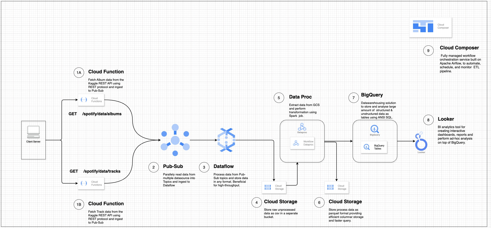

# Spotify kaggle Analysis

## Overview

Spotify Kaggle Analysis is a comprehensive end-to-end data pipeline that efficiently extracts Spotify datasets from Kaggle, performs advanced transformations using Apache Spark, and seamlessly loads the processed data into PostgreSQL for further analysis and insights. The README file also includes a detailed Big Data Cloud Architecture solution leveraging GCP services. It outlines a scalable, efficient, and robust design for the data pipeline, ensuring seamless data ingestion, transformation, and storage.

## Prerequisites

- Python version: 3.12.x
- Required libraries: See `requirements.txt`
- Other dependencies: List any additional dependencies required for the project.

## Installation

1. **Clone the repository**:
    ```bash
    git clone https://github.com/AnkitWorld1995/spotify_kaggle_analysis.git
    ```

2. **Navigate to the project directory**:
    ```bash
    cd spotify_kaggle_analysis
    ```

3. **Set up a virtual environment** (optional but recommended):
    ```bash
    python3 -m venv venv
    source venv/bin/activate  # On Windows: venv\Scripts\activate
    ```

4. **Install dependencies**:
    ```bash
    pip install -r requirements.txt
    ```

5. **Usage**:

To run the application, use the following command:

   ```bash
      python main.py config.yml
   ```

6. **Testing**:

To run test cases, use the following command:
 ```bash
    pytest -v
 ```


7. **Spotify GCP Bigdata Architecture**:

# Spotify Kaggle Data Pipeline Architecture (Google Cloud Platform)

[Spotify-GCP-BigData-Architecture.jpg](docs/images/Spotify-GCP-BigData-Architecture.jpg)

This architecture outlines an end-to-end ETL pipeline that extracts Spotify dataset from Kaggle, processes it using Google Cloud services, and loads it into BigQuery for analysis.

## **Workflow Overview**

1. **Cloud Function**: Fetches album and track data from the Kaggle REST API and ingests it into **Pub/Sub**.  
2. **Pub/Sub**: Acts as a messaging system to stream data from multiple sources to **Dataflow**.  
3. **Dataflow**: Processes data from Pub/Sub and stores it in Cloud Storage for further transformation.  
4. **Cloud Storage**: Stores raw unprocessed data as CSV in a separate bucket.  
5. **Dataproc**: Runs Apache Spark jobs to extract, transform, and process data from Cloud Storage.  
6. **Cloud Storage**: Stores processed data in **Parquet format**, which provides efficient columnar storage for faster querying.  
7. **BigQuery**: Serves as the data warehouse to store and analyze structured and unstructured data using ANSI SQL.  
8. **Looker**: A BI tool used to create interactive dashboards, reports, and perform ad-hoc analytics on BigQuery data.  
9. **Cloud Composer**: A fully managed workflow orchestration service (Apache Airflow) to automate, schedule, and monitor the ETL pipeline.  

This GCP-based big data pipeline enables efficient data ingestion, processing, and analysis of Spotify datasets at scale. 🚀


